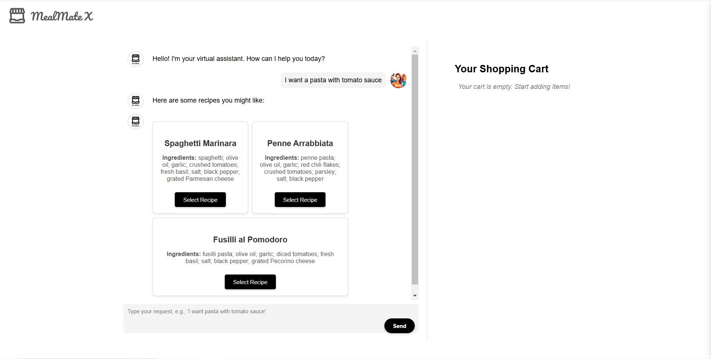

# MealMate
MealMate helps you facilitate food shopping in grocery scenarios.
Three agents are integrated in our framework:
* Chef de cuisine: generate recipe(i.e. ingredients and instructions) for the desired dish
* Line cook: Check stock in database and make substitutions based on the recipe generated by chef de cuisine
* Recommender: Propose recommendations for substitution, dish, and store based on customer preference.

#### Demo Layout


## Workflow
### Customer Manager
A `ConversableAgent` that gets customers' requirement and chats with staff.

### Chef de cuisine
A `ConversableAgent` that breaks down recipe for wanted dishes.
- Input and Config:
    - System Message: You are an experienced chef. You need to understand users' requirement to break down the recipe.
    - Example Prompt: I want to have pasta with tomato sauce tonight.
- Process:
    - Tool Use: A list of valid ingredients, only return names in the list.
- Expected Output: Ingredients with quantities.

### Line cook
A `ConversableAgent` that confirms stock availability.
- Input and Config:
    - System Message: You need to check stock in database based on recipe obtained from chef de cuisine.
    - Example Prompt: Please check the availability of ingredients and return an applicable list. 
    - Context: Summary of previous chat.
- Process:    
    - Tool Use:
        1. A function getting real-time stock data. A for loop checking every ingredient.
        2. Recommender: Optional
- Expected Output: An applicable list of ingredients necessary for the dish


## Setup Instructions

### Clone the repository:
```bash
git clone git@github.com:LIYunzhe1408/MealMate.git
cd MealMate
```

### Backend Setup
1. Navigate to the backend directory:
    ```bash
    cd backend
    ```

2. Create and activate a virtual environment:
    ```bash
    python -m venv venv
    source venv/bin/activate   # On Windows: venv\Scripts\activate
    ```
3. Install dependencies:
    ```bash
    pip install -r requirements.txt
    ```

4. Launch backend:
    ```bash
    python app.py
    ```

### Frontend Setup
1. Navigate to the frontend directory:
    ```bash
    cd frontend
    ```
2. Install dependencies:
    ```bash
    npm install
    ```
3. Launch the development server:
    ```bash
    npm start
    ```


## Additional Notes
- Ensure you have Python 3.8+ and Node.js 14+ installed for compatibility.
- For deployment instructions, refer to the `DEPLOYMENT.md` file (if applicable).
