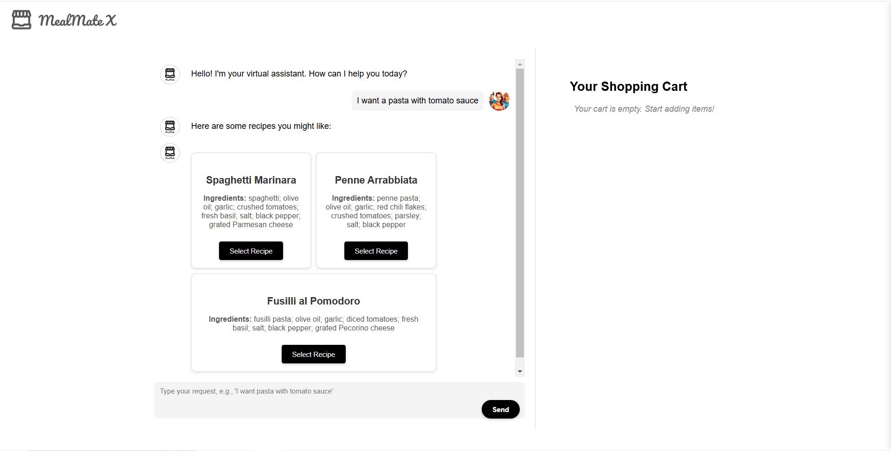
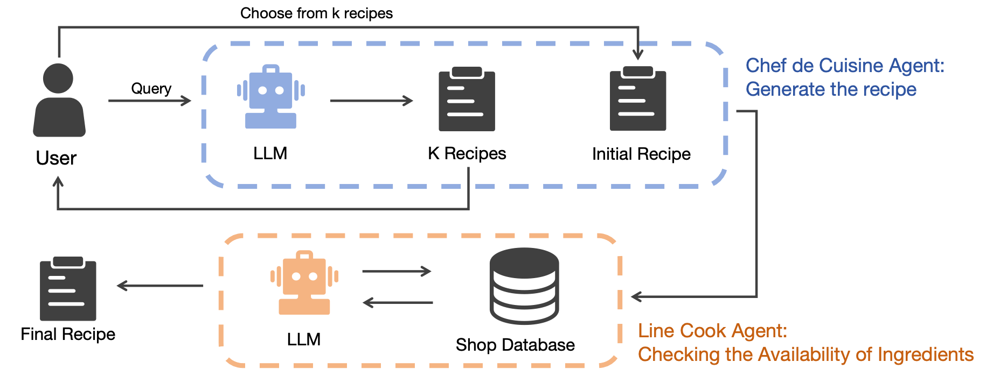
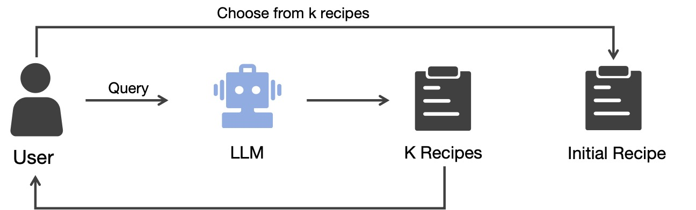
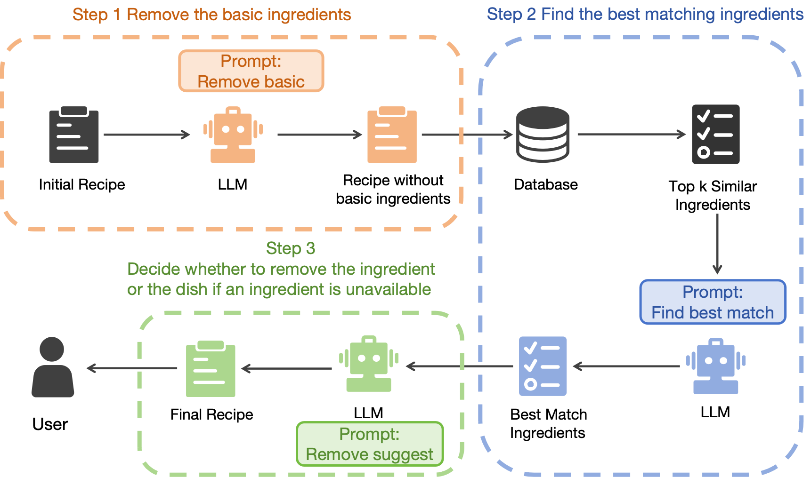

# MealMate: From Food Cravings to Shopping Carts  
Contributors: [Jonas Li](https://github.com/LIYunzhe1408), [Jasper Liu](https://github.com/JJJasperl), [Mats Martinussen](https://github.com/MatsStuben), [Emil Klovning](https://github.com/emilklo), [Jason Ji](https://github.com/20jij), [Qinghe Zheng](https://github.com/zqh0429)

Affiliation: UC Berkeley

MealMate is an intelligent meal planning assistant that simplifies food shopping by seamlessly integrating recipe generation, ingredient availability checks, and personalized substitutions. Powered by advanced multi-agent collaboration and large language models (LLMs), MealMate delivers tailored shopping lists based on user preferences and real-time store inventory.

**Quick access**
* [Demo video](https://youtu.be/bAT-jZhDtCw?si=QK4Et1dV991vbpeL)
* [Project report](https://www.overleaf.com/read/wfsggtsqhzsv#1e8e83)

[](https://youtu.be/bAT-jZhDtCw?si=QK4Et1dV991vbpeL)

---

## Key Features  
- **Chef De Cuisine Agent**: Generates recipes, including detailed ingredients and instructions, based on user prompts.  
- **Line Cook Agent**: Verifies stock availability in nearby stores, making smart substitutions based on user preference when needed.  

---

## Workflow Overview  


### Customer Interaction
A user inputs their desired dish (e.g., "I want pasta with tomato sauce tonight"). The **Chef De Cuisine Agent** generates multiple recipe options based on this request.

### Recipe Breakdown
The Chef De Cuisine Agent provides the recipe details, breaking it down into ingredients with specified quantities.

### Ingredient Availability Check
The **Line Cook Agent** cross-references the recipe ingredients with real-time store inventory:
- Identifies available items.
- Suggests substitutions for missing ingredients using the **Recommender Agent**.
- Returns a finalized, actionable shopping list.

### Final Output
Users receive a tailored recipe and shopping list, optimized for their preferences, including:
- Selected or substituted ingredients.  
- Pricing and location details.

---

## Agent Configurations  

### Chef De Cuisine Agent  
A specialized agent for generating recipes based on user requirements.  
- **Input & Configurations**:  
    - *System Message*: "You are an experienced chef. Break down the recipe based on user needs."  
    - *Example Prompt*: "I want pasta with tomato sauce tonight."  
- **Process**:  
    - Leverages a database of valid ingredients.  
    - Outputs ingredients and quantities.  


### Line Cook Agent  
Responsible for verifying stock availability and providing substitutions and providing recommendations for substitutions, alternative dishes, or stores.
- **Input & Configurations**:  
    - *System Message*: "Check ingredient stock in the database based on the recipe."  
- **Process**:  
    - Real-time stock data validation.  
    - Provides recommendations for substitutions, alternative dishes, or store based on user preferences (e.g., price sensitivity, allergies).
- **Output**:  
    - A shopping list tailored to the recipe and store availability.  



---

## Setup Instructions

### Clone the repository:
```bash
git clone git@github.com:LIYunzhe1408/MealMate.git
cd MealMate
```

### Backend Setup
1. Navigate to the backend directory:
    ```bash
    cd backend
    ```

2. Create and activate a virtual environment:
    ```bash
    python -m venv venv
    source venv/bin/activate   # On Windows: venv\Scripts\activate
    ```
3. Install dependencies:
    ```bash
    pip install -r requirements.txt
    ```

4. Launch backend:
    ```bash
    python app.py
    ```

### Frontend Setup
1. Navigate to the frontend directory:
    ```bash
    cd frontend
    ```
2. Install dependencies:
    ```bash
    npm install
    ```
3. Launch the development server:
    ```bash
    npm start
    ```


## Additional Notes
- Ensure you have Python 3.8+ and Node.js 14+ installed for compatibility.
- For deployment instructions, refer to the `DEPLOYMENT.md` file (if applicable).
